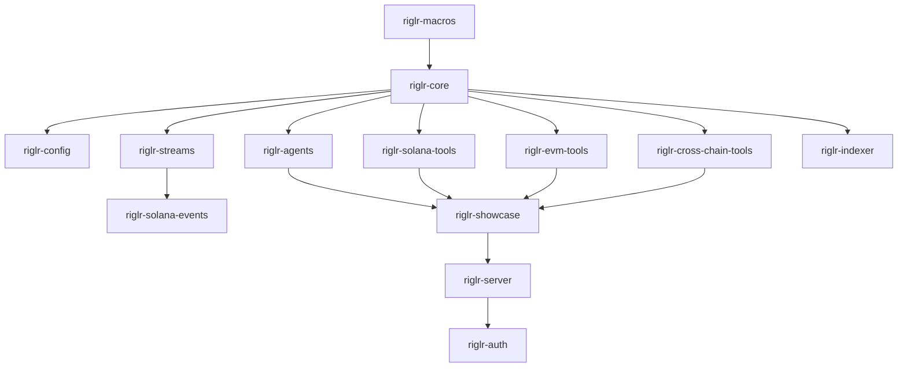
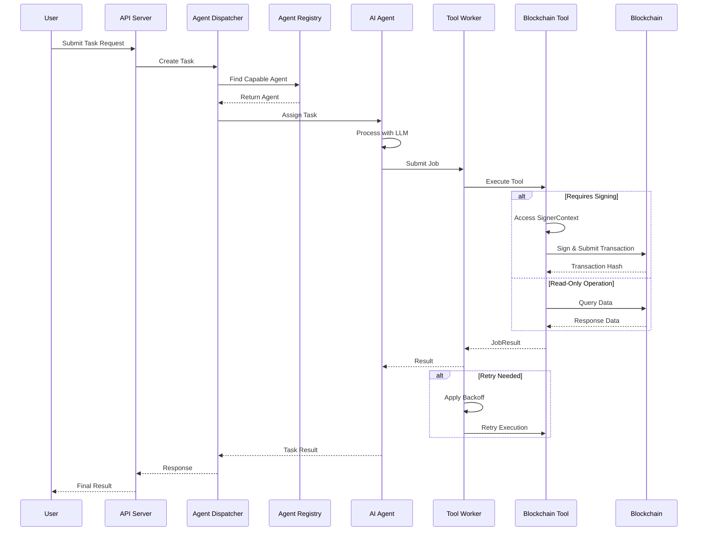

# riglr Architecture Guide

## Overview

riglr is a modular Rust framework for building AI agents that interact with blockchains. It extends the [rig](https://github.com/0xPlaygrounds/rig) AI framework with blockchain-specific capabilities, providing a comprehensive toolkit for developing autonomous blockchain agents.

## System Design Philosophy

riglr follows these core design principles:

1. **Modularity**: Each crate has a single, well-defined responsibility
2. **Extensibility**: New blockchains and tools can be added without modifying core
3. **Safety**: Type-safe abstractions over blockchain operations with compile-time guarantees
4. **Performance**: Async-first design with efficient resource pooling and rate limiting
5. **Testability**: Comprehensive testing utilities and mock implementations

## Crate Architecture



### Core Layer

#### riglr-core
The foundation of the framework, providing:
- **Tool Abstraction**: `Tool` trait for implementing blockchain operations
- **Job System**: `Job` and `JobResult` types for task execution
- **Worker System**: `ToolWorker` for concurrent job processing with retry logic
- **Signer Context**: Thread-local cryptographic signer management
- **Application Context**: Dependency injection for blockchain clients
- **Error Handling**: Rich error types with retry semantics

#### riglr-config
Unified configuration management:
- Environment variable parsing and validation
- Configuration schema for all riglr components
- Multi-chain RPC URL management
- Security-first defaults (testnet by default)

#### riglr-macros
Procedural macros for code generation:
- `#[tool]` macro for automatic rig integration
- Reduces boilerplate for tool implementation
- Generates JSON schema from Rust structs

### Blockchain Tools Layer

#### riglr-solana-tools
Solana blockchain operations:
- SOL and SPL token transfers
- Swap operations via Jupiter aggregator
- Staking and delegation operations
- Account and transaction queries

#### riglr-evm-tools
EVM-compatible chain operations:
- ETH and ERC20 token transfers
- Smart contract interactions
- Gas estimation and management
- Multi-chain support (Ethereum, Polygon, BSC, etc.)

#### riglr-cross-chain-tools
Cross-chain bridging and operations:
- Asset bridging between chains
- Cross-chain message passing
- Unified balance queries

### Data & Coordination Layer

#### riglr-agents
Multi-agent coordination system:
- **Agent Registry**: Local and distributed (Redis) agent discovery
- **Agent Dispatcher**: Task routing based on capabilities
- **RigToolAdapter**: Bridge between riglr tools and rig agents
- **Message Passing**: Inter-agent communication protocols

#### riglr-streams
Real-time blockchain event streaming:
- WebSocket-based event subscriptions
- Configurable event filters
- Automatic reconnection and error recovery

#### riglr-solana-events
Solana-specific event parsing:
- Transaction log parsing
- Program event decoding
- IDL-based event interpretation

#### riglr-indexer
Blockchain data indexing:
- Historical data retrieval
- Local database caching
- Query optimization

### Application Layer

#### riglr-showcase
Example implementations and demos:
- Sample agents for common use cases
- Integration examples
- Testing utilities

#### riglr-server
Production HTTP server:
- RESTful API endpoints
- WebSocket support for real-time updates
- Health checks and monitoring
- Rate limiting and authentication

#### riglr-auth
Authentication providers:
- API key management
- JWT token validation
- OAuth2 integration
- Permission management

## Core Patterns

### SignerContext Pattern

The SignerContext provides secure, thread-local access to cryptographic signers:

```rust
// Tools requiring signing operations
SignerContext::with_signer(signer, async {
    // Any tools called here have access to the signer
    let result = transfer_sol(recipient, amount).await?;
    Ok(result)
}).await?;
```

This pattern ensures:
- Signers are never passed directly to tools
- Thread-safe access in concurrent environments
- Automatic cleanup when context exits

### ApplicationContext Pattern

Dependency injection for blockchain clients and shared resources:

```rust
let mut context = ApplicationContext::from_config(&config);
context.set_extension(Arc::new(solana_client));
context.set_extension(Arc::new(ethereum_provider));

// Tools retrieve clients from context
let client = context.get_extension::<SolanaClient>()?;
```

### Tool Macro Pattern

The `#[tool]` macro simplifies tool creation:

```rust
#[tool]
async fn get_balance(
    address: String,
    #[context] ctx: &ApplicationContext,
) -> Result<Balance, ToolError> {
    let client = ctx.get_extension::<SolanaClient>()?;
    client.get_balance(&address).await
}
```

## Task Lifecycle

The following sequence diagram illustrates how a task flows through the system:



## Getting Started for Contributors

### Adding a New Tool

1. **Create the tool implementation**:
```rust
// In riglr-[chain]-tools/src/tools/my_tool.rs
use riglr_core::{Tool, ToolError, JobResult};

#[async_trait]
impl Tool for MyTool {
    async fn execute(
        &self,
        params: serde_json::Value,
        context: &ApplicationContext,
    ) -> Result<JobResult, ToolError> {
        // Implementation
    }
    
    fn name(&self) -> &str {
        "my_tool"
    }
    
    fn description(&self) -> &str {
        "Description of what this tool does"
    }
    
    fn schema(&self) -> serde_json::Value {
        // JSON schema for parameters
    }
}
```

2. **Register with a worker**:
```rust
let worker = ToolWorker::new(config);
worker.register_tool(Arc::new(MyTool::new())).await;
```

3. **Write tests**:
```rust
#[tokio::test]
async fn test_my_tool() {
    let tool = MyTool::new();
    let params = json!({ "param": "value" });
    let context = ApplicationContext::default();
    
    let result = tool.execute(params, &context).await?;
    assert!(matches!(result, JobResult::Success { .. }));
}
```

### Creating a New Agent

1. **Implement the Agent trait**:
```rust
use riglr_agents::{Agent, Task, TaskResult};

#[async_trait]
impl Agent for MyAgent {
    async fn execute_task(&self, task: Task) -> Result<TaskResult> {
        // Use LLM to determine actions
        let tools = self.determine_tools(&task)?;
        
        // Execute tools
        for tool in tools {
            let result = self.execute_tool(tool).await?;
            // Process result
        }
        
        Ok(TaskResult::success(output))
    }
    
    fn capabilities(&self) -> Vec<String> {
        vec!["trading".into(), "defi".into()]
    }
}
```

2. **Register with the registry**:
```rust
let registry = LocalAgentRegistry::new();
registry.register_agent(Arc::new(MyAgent::new())).await?;
```

### Testing Best Practices

1. **Unit Tests**: Test individual components in isolation
2. **Integration Tests**: Test interactions between components
3. **E2E Tests**: Test complete workflows with mock blockchains
4. **Blockchain Tests**: Test against real testnets (marked with `#[ignore]`)

```rust
// Run all tests
cargo test --workspace

// Run only unit tests
cargo test --workspace --lib

// Run integration tests
cargo test --workspace --test '*'

// Run blockchain tests (requires configuration)
cargo test --workspace --features blockchain-tests -- --ignored
```

## Configuration

riglr uses environment variables for configuration:

```bash
# Solana Configuration
SOLANA_RPC_URL=https://api.devnet.solana.com
SOLANA_PRIVATE_KEY=your_private_key_here

# EVM Configuration
RPC_URL_1=https://eth-mainnet.g.alchemy.com/v2/your_key
RPC_URL_137=https://polygon-mainnet.g.alchemy.com/v2/your_key

# Redis Configuration (for distributed registry)
REDIS_URL=redis://localhost:6379

# API Server Configuration
SERVER_HOST=0.0.0.0
SERVER_PORT=8080
API_KEY=your_api_key_here
```

## Security Considerations

1. **Never commit private keys** - Use environment variables or secure vaults
2. **Default to testnet** - Production networks require explicit configuration
3. **Validate all inputs** - Especially addresses and amounts
4. **Use SignerContext** - Never pass signers directly to tools
5. **Rate limiting** - Built-in rate limiting for RPC calls
6. **Audit logging** - All transactions are logged for audit trails

## Performance Optimization

1. **Connection Pooling**: Reuse blockchain connections
2. **Request Batching**: Batch multiple RPC calls when possible
3. **Caching**: Use built-in caching for frequently accessed data
4. **Async Everything**: All I/O operations are async
5. **Resource Pools**: Configurable concurrency limits per resource

## Monitoring and Observability

riglr integrates with standard observability tools:

- **Logging**: Structured logging with `tracing`
- **Metrics**: Prometheus-compatible metrics
- **Tracing**: OpenTelemetry support for distributed tracing
- **Health Checks**: Built-in health check endpoints

## Future Roadmap

- [ ] Additional blockchain support (Cosmos, Near, etc.)
- [ ] Advanced agent reasoning with planning capabilities
- [ ] Distributed task execution across multiple nodes
- [ ] Built-in simulation and backtesting framework
- [ ] GraphQL API support
- [ ] Plugin system for custom extensions

## Contributing

We welcome contributions! Please see [CONTRIBUTING.md](CONTRIBUTING.md) for guidelines.

## License

This project is licensed under the MIT License - see the [LICENSE](LICENSE) file for details.