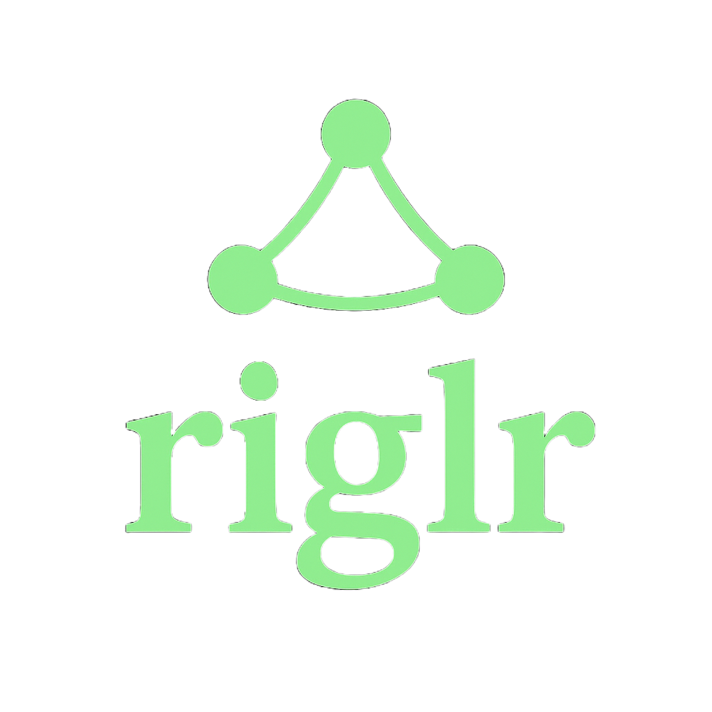

<div align="center">
  
  
  # riglr - Production-Ready AI Agent Framework for Blockchain

  [](https://github.com/riglr/riglr/actions)
  [](https://crates.io/crates/riglr-core)
  [](https://docs.rs/riglr-core)
  [](https://opensource.org/licenses/MIT)
  
  **Token Address:** `EEmm3orvPXt61Z1yMN9xenE1Rfpj3FEU5WcG1H8mpump`
</div>

> ⚠️ **UNDER HEAVY DEVELOPMENT**: This project is being actively developed with frequent updates. APIs may change and things will probably break. Use with caution in production environments.

## What Makes riglr Different?

**riglr** transforms the powerful `rig` LLM framework into a **production-grade platform** for blockchain AI agents. While `rig` provides the "brain" (LLM-to-tool connections), riglr adds the complete "body and nervous system" with battle-tested patterns from real deployments:

- **10,000+ events/second** throughput with parallel processing and backpressure handling
- **Thread-local transaction signing** (`SignerContext`) that never exposes keys to the LLM
- **Multi-tenant isolation** with zero cross-contamination risk between concurrent users
- **`#[tool]` macro** eliminates 30+ lines of boilerplate - just one line to create a tool
- **Two-level error handling** with automatic retry logic and exponential backoff
- **Clean dependency injection** (`ApplicationContext`) for modular, testable code
- **Production resilience** with circuit breakers, idempotency stores, and health checks
- **Zero-code chain additions** - add new EVM chains via environment variables

## Key Production Patterns

These battle-tested patterns differentiate riglr from other frameworks:

### 1. **`SignerContext`: Secure Multi-Tenant Transaction Signing**
```rust
// Each user request gets completely isolated signer context
SignerContext::with_signer(user_signer, async {
    // Keys NEVER exposed to LLM reasoning loop
    // Automatic cleanup when scope exits
    // Zero cross-tenant contamination risk
    agent.execute("Send 0.1 SOL to alice.sol").await
}).await
```
**Why It Matters**: Keys are never passed as parameters, preventing exposure to the LLM. Complete isolation between concurrent users in production.

### 2. **`ApplicationContext`: Clean Dependency Injection**
```rust
// Application injects dependencies once
context.set_extension(Arc::new(solana_client));
context.set_extension(Arc::new(evm_provider));

// Tools retrieve what they need - no hardcoding
#[tool]
async fn get_balance(address: String) -> Result<f64, ToolError> {
    let client = context.get_extension::<SolanaClient>()?;
    // Use client...
}
```
**Why It Matters**: Decouples tools from implementations, enables mock testing, supports multiple chains without circular dependencies.

### 3. **`#[tool]` Macro: 30 Lines → 1 Line**
```rust
// Before: 30+ lines of boilerplate for Tool trait impl
// After: Just one line
#[tool]
async fn swap_tokens(from: String, to: String, amount: u64) -> Result<String, ToolError> {
    // Your logic only - macro handles all boilerplate
}
```
**Generated Automatically**: Parameter struct, JSON schema, Tool trait impl, error conversion, documentation extraction.

### 4. **Two-Level Error Handling with Auto-Retry**
```rust
// High-level behavioral classification
match error {
    ToolError::Retriable(_) => // Automatic exponential backoff
    ToolError::RateLimited(_) => // Respect rate limits
    ToolError::Permanent(_) => // Don't retry
}

// Low-level chain-specific details preserved
if let Some(solana_error) = error.downcast::<SolanaToolError>() {
    match solana_error {
        SolanaToolError::BlockhashExpired => // Handle specifically
    }
}
```

### 5. **Multi-Agent Coordination System**
```rust
// Specialized agents work together
let research_result = dispatcher.dispatch_task(
    Task::new(TaskType::Research, market_data)
).await?;

let risk_result = dispatcher.dispatch_task(
    Task::new(TaskType::RiskAnalysis, research_result)
).await?;

if risk_result.approved() {
    dispatcher.dispatch_task(Task::new(TaskType::Trading, ...)).await?;
}
```

### 6. **Real-Time Event Processing (10k+ events/sec)**
```rust
// Composable stream pipeline with backpressure handling
let processed_stream = solana_stream
    .filter(|e| matches!(e.kind(), EventKind::Swap))
    .map(extract_metrics)
    .throttle(Duration::from_secs(10))
    .batch(50, Duration::from_secs(60));
```


## Quick Example

```rust
// 1. Define a tool with ZERO boilerplate
#[tool]
async fn transfer_sol(to: String, amount: f64) -> Result<String, ToolError> {
    // SignerContext automatically provides the signer
    let signer = SignerContext::get_signer()?;
    // Your logic here
}

// 2. Build an agent with automatic tool discovery
let agent = ToolCallingAgentBuilder::new()
    .with_tools(riglr_solana_tools::all_tools())
    .build(openai_client.agent("gpt-4o"))
    .await?;

// 3. Execute with secure, isolated signing
SignerContext::with_signer(user_signer, async {
    // Signer is ONLY available within this scope
    // Automatic cleanup when scope exits
    agent.chat("Send 0.1 SOL to alice.sol").await?
}).await?;
```

## Architecture

riglr uses a modular, multi-crate architecture with clear separation of concerns. The framework is organized into specialized crates:
- **Core Layer**: Foundation (`riglr-core`), code generation (`riglr-macros`), and unified configuration (`riglr-config`).
- **Blockchain Layer**: Tools for Solana (`riglr-solana-tools`), EVM chains (`riglr-evm-tools`), and cross-chain operations (`riglr-cross-chain-tools`).
- **Data & Coordination Layer**: Real-time event streaming (`riglr-streams`), data indexing (`riglr-indexer`), multi-agent systems (`riglr-agents`), and external web APIs (`riglr-web-tools`).
- **Application Layer**: Production server (`riglr-server`), pre-built agents (`riglr-showcase`), and authentication (`riglr-auth`).

### Dual-Pattern Architecture

riglr implements two complementary patterns:

**Client Injection Pattern** (Read-only operations):
```rust
// Application creates and injects all clients
let config = Config::from_env();
let app_context = ApplicationContext::from_config(&config);

// Inject blockchain clients
let solana_client = Arc::new(RpcClient::new(config.network.solana_rpc_url));
app_context.set_extension(solana_client);

let evm_client = Arc::new(EvmClient::new("https://eth.llamarpc.com").await?);
app_context.set_extension(evm_client);

// Tools retrieve clients from context's extensions
#[tool]
async fn get_balance(address: String) -> Result<Balance, ToolError> {
    let app_context = ApplicationContext::from_env();
    let client = app_context.get_extension::<Arc<RpcClient>>()?;
    // Use client...
}
```

**SignerContext Pattern** (Transactional operations):
```rust
// Create signer with network configuration
let signer = Arc::new(LocalSolanaSigner::from_keypair(keypair, network_config));

// Execute transactions within signer context
SignerContext::with_signer(signer, async {
    transfer_sol(recipient, amount).await
}).await?;
```

## Two-Level Error Handling Pattern

riglr uses a sophisticated two-level error handling pattern for robust blockchain interactions:

### High-Level: Behavior-Based Retry Logic

At the framework level, errors are classified by behavior (retriable, permanent, rate-limited) not by chain:

```rust
use riglr_core::ToolError;
use riglr_core::retry::retry_async;

// Framework automatically retries based on error classification
let result = retry_async(
    || async { perform_blockchain_operation().await },
    |error| match error {
        ToolError::Retriable(_) => ErrorClass::Retriable,
        ToolError::RateLimited(_) => ErrorClass::RateLimited,
        _ => ErrorClass::Permanent,
    },
    RetryConfig::default()
).await?;
```

### Low-Level: Chain-Specific Error Details

For advanced users who need chain-specific error handling:

```rust
use riglr_core::ToolError;
use riglr_solana_tools::SolanaToolError;

match result {
    Err(tool_error) => {
        // Try to downcast to get chain-specific error details
        if let Some(solana_error) = tool_error.source()
            .and_then(|e| e.downcast_ref::<SolanaToolError>()) {
            // Access Solana-specific error information
            match solana_error {
                SolanaToolError::InsufficientFunds => { /* handle */ },
                SolanaToolError::BlockhashExpired => { /* retry */ },
                _ => { /* other handling */ }
            }
        }
    }
    Ok(value) => { /* success */ }
}
```

This pattern provides both simplicity for common cases and power for advanced scenarios.

## Documentation

The riglr documentation is available at [riglr.com/docs](https://riglr.com/docs) and includes:

- **[Getting Started Guide](https://riglr.com/docs/getting-started/quick-start)** - Quick introduction to riglr
- **[Architecture Overview](https://riglr.com/docs/concepts/architecture-overview)** - Comprehensive system design
- **[Under the Hood](https://riglr.com/docs/concepts/under-the-hood)** - From brain to blockchain flow
- **[Dependency Graph](https://riglr.com/docs/concepts/dependency-graph)** - Visual crate relationships
- **[API Reference](https://riglr.com/docs/api-reference/)** - Complete API documentation
- **[Tutorials](https://riglr.com/docs/tutorials)** - Step-by-step guides for common use cases

### Building the Documentation Locally

```bash
# Install mdBook
cargo install mdbook

# Build the documentation
cd docs
mdbook build

# Serve locally
mdbook serve --open
```

## Quick Start with `create-riglr-app`

The easiest way to start is with our official project generator.

### 1. Install the Scaffolding Tool
```bash
cargo install create-riglr-app
```

### 2. Generate a New Project
Create a new trading bot project. The interactive CLI will guide you through selecting a template, blockchains, and features.
```bash
create-riglr-app my-trading-bot
```

### 3. Configure and Run
```bash
cd my-trading-bot
cp .env.example .env
# Edit .env with your API keys and RPC URLs
cargo run
```

## Crates Overview

| Crate | Description | Version |
|-------|-------------|---------|
| [riglr-core](./riglr-core) | Core framework, job processing, idempotency, signer traits. | 0.3.0 |
| [riglr-config](./riglr-config) | Unified, hierarchical configuration management. | 0.3.0 |
| [riglr-macros](./riglr-macros) | Procedural macros (`#[tool]`) for rapid tool generation. | 0.2.0 |
| [riglr-agents](./riglr-agents) | Multi-agent coordination system with dispatch and registry. | 0.3.0 |
| [riglr-streams](./riglr-streams) | Real-time event streaming from multiple on-chain and off-chain sources. | 0.2.0 |
| [riglr-indexer](./riglr-indexer) | Production-grade blockchain indexing service. | 0.3.0 |
| [riglr-events-core](./riglr-events-core) | Core event processing abstractions and traits. | 0.3.0 |
| [riglr-solana-events](./riglr-solana-events) | High-performance Solana event parsing for multiple protocols. | 0.3.0 |
| [riglr-solana-tools](./riglr-solana-tools) | Tools for interacting with the Solana blockchain. | 0.3.0 |
| [riglr-evm-tools](./riglr-evm-tools) | Tools for EVM-compatible chains (Ethereum, Polygon, etc.). | 0.3.0 |
| [riglr-web-tools](./riglr-web-tools) | Tools for web APIs (DexScreener, Twitter, News). | 0.3.0 |
| [riglr-auth](./riglr-auth) | Authentication and signer factories (Privy, Web3Auth). | 0.2.0 |
| [riglr-graph-memory](./riglr-graph-memory) | Graph-based memory system with Neo4j. | 0.3.0 |
| [riglr-cross-chain-tools](./riglr-cross-chain-tools) | Cross-chain bridge integration via Li.Fi. | 0.3.0 |
| [riglr-hyperliquid-tools](./riglr-hyperliquid-tools) | Tools for the Hyperliquid perpetuals DEX. | 0.3.0 |
| [riglr-server](./riglr-server) | Turnkey, production-ready HTTP server for agents. | 0.2.0 |
| [riglr-showcase](./riglr-showcase) | Example agents and demonstrations. | 0.3.0 |

## Roadmap

### Current Focus

**End-to-End Testing Suite** - Comprehensive testing with mainnet forking, multi-agent workflows, and CI/CD improvements

**Enhanced `create-riglr-app`** - Expanded templates, interactive CLI, and pre-configured server options

**Production Examples (`riglr-showcase`)** - Real-world agent implementations with best practices

### Next Up

**Developer Experience**

- Interactive tutorials and `riglr-by-example` repository
- Improved documentation with video walkthroughs
- VS Code extension for riglr development

**Advanced Capabilities**

- Expanded Solana event parsing for more protocols
- Graph RAG agent template with Neo4j
- Enhanced multi-agent coordination patterns

**Community & Ecosystem**

- Community tool registry for sharing custom tools
- Official deployment templates for Docker, Kubernetes, Fly.io
- Partnership integrations with major DeFi protocols

---

<p align="center">
  Built with ❤️ by the riglr community
</p>