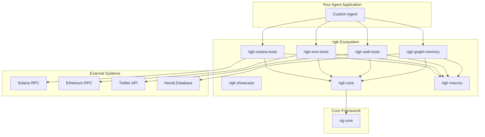

# riglr 🦀⚡

[](https://github.com/riglr-project/riglr/actions)
[](https://crates.io/crates/riglr-core)
[](https://docs.rs/riglr-core)
[](https://opensource.org/licenses/MIT)

> **The premier Rust ecosystem for building high-performance, resilient on-chain AI agents** 

riglr (pronounced "riggler") is a suite of modular, production-ready Rust crates that make it easy to build sophisticated AI agents that interact with blockchains. Built on top of the [rig](https://github.com/0xPlaygrounds/rig) framework, riglr provides everything you need to create powerful crypto-native applications.

## ✨ Features

- 🔧 **Zero Boilerplate**: `#[tool]` macro automatically implements `rig::Tool`
- ⚡ **High Performance**: Async-first design with built-in concurrency control
- 🛡️ **Production Ready**: Comprehensive error handling, retries, and timeouts
- 🔗 **Multi-Chain**: Native support for Solana, Ethereum, and other EVM chains
- 🧠 **Smart Memory**: Graph-based memory system with vector search capabilities
- 🌐 **Rich Data Sources**: Twitter, DexScreener, web search, and more
- 📦 **Modular**: Use only what you need - each crate is independent

## 🚀 Quick Start

### Installation

Add the crates you need to your `Cargo.toml`:

```toml
[dependencies]
# Core functionality
riglr-core = "0.1"
riglr-macros = "0.1"

# Blockchain tools
riglr-solana-tools = "0.1"
riglr-evm-tools = "0.1"

# Data sources and memory
riglr-web-tools = "0.1"
riglr-graph-memory = "0.1"

# rig framework
rig-core = "0.2"
```

### Your First Agent

```rust
use rig_core::Agent;
use riglr_solana_tools::get_sol_balance;

#[tokio::main]
async fn main() -> anyhow::Result<()> {
    // Create an agent with Solana tools
    let agent = Agent::builder()
        .preamble("You are a helpful Solana blockchain assistant.")
        .tool(get_sol_balance)
        .build();

    // Ask the agent to check a balance
    let response = agent
        .prompt("What's the SOL balance of So11111111111111111111111111111111111111112?")
        .await?;

    println!("Agent: {}", response);
    Ok(())
}
```

### Creating Custom Tools

The `#[tool]` macro makes it incredibly easy to create new tools:

```rust
use riglr_macros::tool;
use serde::{Deserialize, Serialize};
use schemars::JsonSchema;

#[derive(Deserialize, JsonSchema)]
struct SwapQuoteArgs {
    /// Input token mint address
    input_mint: String,
    /// Output token mint address  
    output_mint: String,
    /// Amount to swap in base units
    amount: u64,
}

#[derive(Serialize)]
struct SwapQuote {
    input_amount: u64,
    output_amount: u64,
    price_impact: f64,
}

/// Get a swap quote from Jupiter aggregator
#[tool]
async fn get_jupiter_quote(args: SwapQuoteArgs) -> anyhow::Result<SwapQuote> {
    // Your implementation here
    todo!("Implement Jupiter API call")
}
```

That's it! The `#[tool]` macro automatically:
- Generates the JSON schema from your structs
- Implements the `rig::Tool` trait
- Extracts descriptions from your doc comments
- Handles serialization and error conversion

## 📦 Crate Overview

| Crate | Description | Status |
|-------|-------------|---------|
| [`riglr-core`](riglr-core) | Job execution engine, queues, resilience patterns | ✅ Foundation |
| [`riglr-macros`](riglr-macros) | `#[tool]` proc macro for zero-boilerplate tool creation | ✅ Foundation |
| [`riglr-solana-tools`](riglr-solana-tools) | Solana blockchain tools (balances, transfers, Jupiter swaps) | 🚧 In Progress |
| [`riglr-evm-tools`](riglr-evm-tools) | EVM blockchain tools (ETH, tokens, Uniswap) | 🚧 In Progress |
| [`riglr-web-tools`](riglr-web-tools) | Web APIs (Twitter, DexScreener, web search) | 🚧 In Progress |
| [`riglr-graph-memory`](riglr-graph-memory) | Graph-based memory with Neo4j backend | 🚧 In Progress |
| [`riglr-showcase`](riglr-showcase) | Example applications and demos | 🚧 In Progress |

## 🏗️ Architecture



## 🎯 Use Cases

### DeFi Trading Bot
```rust
use rig_core::Agent;
use riglr_solana_tools::{get_sol_balance, get_jupiter_quote, perform_jupiter_swap};
use riglr_web_tools::search_tweets;

let trading_agent = Agent::builder()
    .preamble("You are a DeFi trading assistant that analyzes market sentiment and executes trades.")
    .tool(get_sol_balance)
    .tool(get_jupiter_quote)
    .tool(perform_jupiter_swap)
    .tool(search_tweets)
    .build();
```

### Cross-Chain Portfolio Manager  
```rust
use riglr_solana_tools::get_spl_token_balance;
use riglr_evm_tools::{get_eth_balance, get_erc20_balance};

let portfolio_agent = Agent::builder()
    .preamble("You help users track their multi-chain portfolio.")
    .tool(get_sol_balance)
    .tool(get_spl_token_balance)
    .tool(get_eth_balance) 
    .tool(get_erc20_balance)
    .build();
```

### Wallet Analysis with Memory
```rust
use riglr_graph_memory::GraphMemory;

let memory = GraphMemory::new("neo4j://localhost:7687").await?;

let analyst_agent = Agent::builder()
    .preamble("You analyze wallet transaction patterns and relationships.")
    .dynamic_context(5, memory) // Use graph as vector store
    .tool(get_transaction_history)
    .build();
```

## 🧪 Examples

Check out the [`riglr-showcase`](riglr-showcase) crate for complete examples:

- **Solana Balance Checker**: Simple balance checking agent
- **Cross-Chain Analyzer**: Multi-chain portfolio analysis  
- **Trading Bot**: Jupiter swap integration with sentiment analysis
- **Wallet Investigator**: Graph memory for transaction analysis

Run examples:
```bash
cargo run --bin riglr-showcase solana --address So11111111111111111111111111111111111111112
cargo run --bin riglr-showcase cross-chain --token USDC
cargo run --bin riglr-showcase interactive
```

## 🔧 Development

### Prerequisites
- Rust 1.70+
- tokio async runtime
- Optional: Redis (for production job queues)
- Optional: Neo4j (for graph memory)

### Building from Source
```bash
git clone https://github.com/riglr-project/riglr.git
cd riglr
cargo build --workspace
cargo test --workspace
```

### Project Structure
```
riglr/
├── riglr-core/          # Job execution and resilience
├── riglr-macros/        # Procedural macros  
├── riglr-solana-tools/  # Solana blockchain tools
├── riglr-evm-tools/     # EVM blockchain tools
├── riglr-web-tools/     # Web API integrations
├── riglr-graph-memory/  # Graph database memory
├── riglr-showcase/      # Example applications
└── docs/                # Additional documentation
```

## 🤝 Contributing

We love contributions! Please see our [Contributing Guide](CONTRIBUTING.md) for details on:

- Code style and standards
- Development workflow  
- Testing guidelines
- How to submit PRs

### Good First Issues

Look for issues labeled [`good first issue`](https://github.com/riglr-project/riglr/labels/good%20first%20issue) - these are perfect for new contributors!

## 🗺️ Roadmap

### Phase 1: Foundation (✅ Complete)
- [x] Workspace structure and CI/CD
- [x] Core execution engine (`riglr-core`)
- [x] `#[tool]` macro (`riglr-macros`)

### Phase 2: Core Tools (🚧 In Progress)  
- [ ] Solana tools (`riglr-solana-tools`)
- [ ] EVM tools (`riglr-evm-tools`)
- [ ] Integration tests and examples

### Phase 3: Advanced Features (📅 Planned)
- [ ] Graph memory system (`riglr-graph-memory`)
- [ ] Web tools (`riglr-web-tools`)  
- [ ] Advanced examples

### Phase 4: Ecosystem (📅 Planned)
- [ ] Project templates (`create-riglr-app`)
- [ ] Comprehensive documentation
- [ ] Community showcase projects

## 📚 Documentation

- **[Getting Started Guide](docs/getting-started.md)** - Step-by-step introduction
- **[API Reference](https://docs.rs/riglr-core)** - Complete API documentation  
- **[Architecture Guide](docs/architecture.md)** - Deep dive into design decisions
- **[Examples](riglr-showcase/examples/)** - Practical usage examples

## 🙋 FAQ

**Q: How does riglr relate to the rig framework?**
A: riglr is built *on top of* rig and extends it with blockchain-specific tools and production-ready infrastructure. All riglr tools implement `rig::Tool` and work seamlessly with rig agents.

**Q: Can I use individual crates without the full ecosystem?**  
A: Absolutely! Each crate is designed to be independently useful. You can use just `riglr-macros` for the `#[tool]` macro, or only `riglr-solana-tools` for Solana integration.

**Q: What blockchains are supported?**
A: Currently Solana and EVM-compatible chains (Ethereum, Polygon, Arbitrum, etc.). We're open to adding support for other chains based on community demand.

**Q: Is this production-ready?**
A: riglr is designed for production use with proper error handling, retries, and resilience patterns. However, as a new project, please thoroughly test in your specific environment.

## 📄 License

This project is licensed under the [MIT License](LICENSE).

## 🌟 Acknowledgments

- **[rig](https://github.com/0xPlaygrounds/rig)** - The fantastic AI framework that riglr extends
- **[Solana Labs](https://github.com/solana-labs/solana)** - For the robust Solana ecosystem
- **[Ethereum Foundation](https://ethereum.org/)** - For pioneering smart contract platforms

---

<div align="center">

**Built with ❤️ by the riglr community**

[Get Started](docs/getting-started.md) • [Examples](riglr-showcase) • [Contributing](CONTRIBUTING.md) • [Discussions](https://github.com/riglr-project/riglr/discussions)

</div>