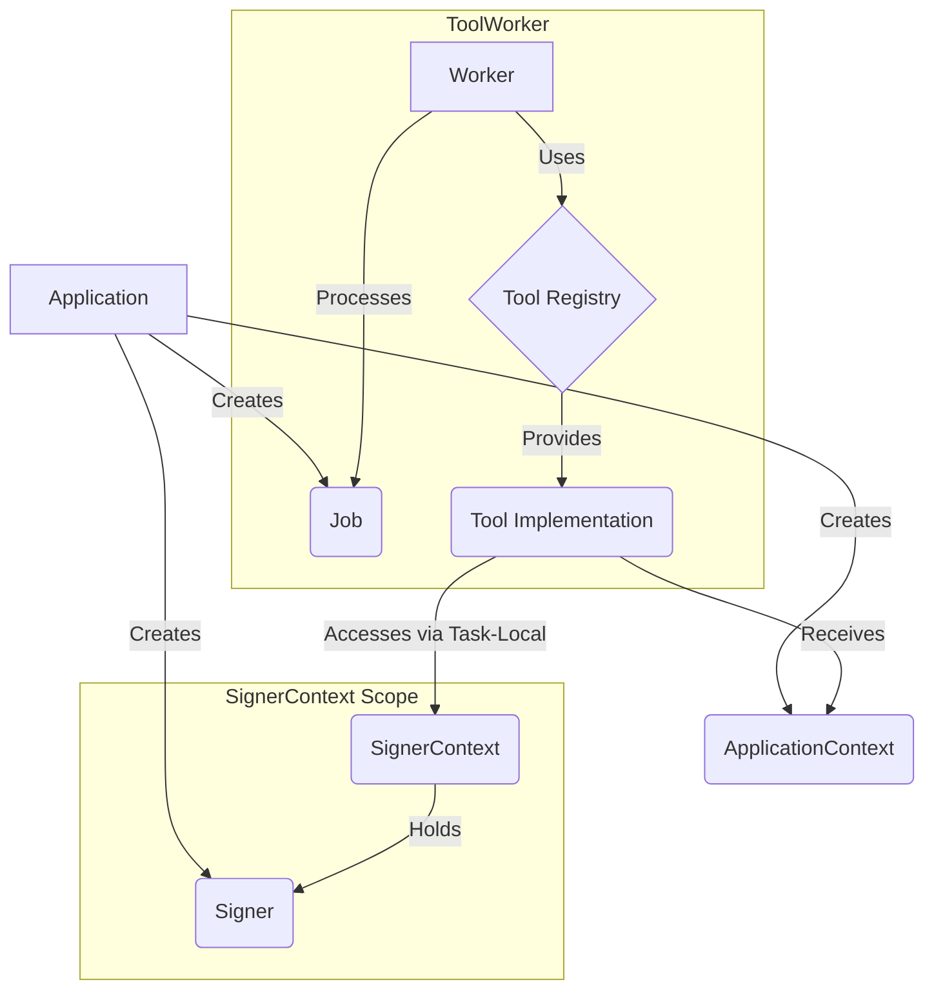

# Core Patterns

This document outlines the production-ready architectural patterns that differentiate riglr from other blockchain agent frameworks. These aren't just features - they're battle-tested patterns designed for real-world deployment at scale.

> **Related Documentation:**
> - [SignerContext Pattern](../signer-context.md) - Deep dive into the SignerContext and ApplicationContext patterns
> - [Architecture Overview](./index.md) - Overall system architecture
> - [Configuration](../configuration.md) - Configuration management patterns
> - [Agents](../agents.md) - Multi-agent coordination patterns
> - [Error Handling](../error-handling.md) - Resilience and error recovery patterns

## 🔒 Production Security Notice

**⚠️ CRITICAL: The file-based key management utilities in riglr-core are for DEVELOPMENT ONLY.**

### For Production Applications, Use Secure Key Management:

#### Option 1: Operating System Keychains (Recommended for desktop apps)
```toml
[dependencies]
keyring = "2.0"
```

```rust
use keyring::Entry;

// One-time key storage
let entry = Entry::new("riglr", "solana_private_key")?;
entry.set_password("your_private_key_here")?;

// Runtime key retrieval
let private_key = entry.get_password()?;
```

#### Option 2: Cloud Secret Managers (Recommended for cloud deployments)
- **AWS Secrets Manager**: Managed secrets with automatic rotation
- **Google Cloud Secret Manager**: Secure secret storage with IAM integration  
- **Azure Key Vault**: Enterprise key management with audit trails
- **HashiCorp Vault**: Open-source secret management platform

#### Option 3: Hardware Security Modules (Enterprise)
- **AWS CloudHSM**: FIPS 140-2 Level 3 validated HSMs
- **YubiHSM**: Compact hardware security modules
- **Ledger/Trezor**: Hardware wallet integration

### Security Principles:
- 🔑 **Never store private keys in code or configuration files**
- 🔒 **Use encrypted storage with access controls**
- 📋 **Implement audit logging for key access**
- 🔄 **Enable automatic key rotation where possible**
- 🌐 **Isolate production and development key storage**

See [`riglr-core::util::secure_keys`] for detailed guidance and examples.

## 1. Security & Multi-Tenancy Patterns

### SignerContext & ApplicationContext

riglr uses two distinct context patterns to ensure clean separation of concerns and maintain security boundaries:

- **ApplicationContext**: An application-wide, shared container for read-only dependencies like RPC clients, API keys, and configuration. It is passed explicitly to tools.
- **SignerContext**: A thread-local, secure context for managing cryptographic signers for transaction signing. It is accessed implicitly via task-local storage.

This separation ensures that read operations can share resources efficiently while write operations are securely isolated per user or request.

**For a detailed guide on these patterns, including usage examples and best practices, see [Signer Context & Application Context](../signer-context.md).**

## 2. Tool System Architecture

### The Tool Trait

The `Tool` trait is the fundamental building block for all agent capabilities in riglr:

```rust
#[async_trait]
pub trait Tool: Send + Sync {
    type Input: Send + Sync;
    type Output: Send + Sync;
    
    async fn execute(
        &self,
        input: Self::Input,
        context: Arc<ApplicationContext>,
    ) -> Result<Self::Output>;
}
```

**Key Features**:
- **Async-First Design**: All operations are async by default for optimal performance
- **Type Safety**: Strong typing with runtime verification where needed
- **Dependency Injection**: All dependencies provided via ApplicationContext
- **Composability**: Tools can be composed rather than inherited

### Job Processing System

Jobs represent units of work to be processed by the ToolWorker:

- **`Job`**: Contains tool identifier, input data, and metadata
- **`JobResult`**: Wraps the output with success/failure status
- **Design**: Type-erased for flexibility, with runtime type checking

### Interaction Flow



## 3. Error Handling & Resilience Patterns

### Two-Level Error Classification

riglr implements a sophisticated, two-level error system to build resilient agents. It distinguishes between **Retriable** and **Permanent** failures, allowing the `ToolWorker` to automatically handle transient issues with exponential backoff while failing fast on unrecoverable errors.

This is complemented by a two-layer retry strategy: a fast, inner layer in the `WebClient` for transient network blips, and a slower, outer layer in the `ToolWorker` for application-level resilience and rate-limit handling.

**For a complete guide on error classification and retry strategies, see the [Error Handling Philosophy](../error-handling.md).**

## 4. Developer Experience Patterns

### #[tool] Macro: Zero Boilerplate

The `#[tool]` procedural macro reduces tool creation from ~30 lines to a single attribute.

**Problem Solved**: Manually implementing the `Tool` trait for every function requires extensive boilerplate for parameter serialization, schema generation, and error handling.

```rust
// Before: 30+ lines of boilerplate with manual Tool implementation

// After: Single annotation
/// A basic tool that greets a user
#[tool]
async fn basic_tool(
    context: &ApplicationContext,  // Automatically injected
    name: String,                  // Becomes a parameter
    age: u32,
) -> Result<String, ToolError> {
    Ok(format!("Hello {}, age {}", name, age))
}
```

**Generated Features**:
- Parameter struct with JSON schema
- Tool trait implementation
- Error conversion
- Documentation extraction
- Convenience constructors

**Benefits**:
- **Reduced Boilerplate**: 80% less code to write
- **Automatic Documentation**: Doc comments become tool descriptions
- **Type Safety**: Full compile-time checking
- **Error Conversion**: Automatic conversion to `JobResult`

## 5. Configuration & Operations Patterns

### Hierarchical Configuration with Validation

Fail-fast configuration management with environment-based settings.

**Features**:
- Environment-based (dev/staging/prod)
- Cross-dependency validation
- Convention over configuration (`RPC_URL_{CHAIN_ID}`)
- Feature flag management
- Production safety checks

```rust
// Production can't use localhost
// Trading requires API keys in production
// Graph memory requires Neo4j
Config::from_env() // Validates everything at startup
```

### Dynamic Chain Support

Add chains without code changes using the `RPC_URL_{CHAIN_ID}` convention:

```bash
# Add new EVM chains via environment variables
RPC_URL_1=https://eth-mainnet.g.alchemy.com/v2/your_key
RPC_URL_137=https://polygon-mainnet.g.alchemy.com/v2/your_key
RPC_URL_56=https://bsc-dataseed.binance.org
```

## 6. Testing & Quality Patterns

### Idempotency Store

Safe retries in distributed systems with multiple backends:

**Backends**:
- In-memory (testing)
- Redis (production)

**Features**:
- Prevents duplicate operations
- Configurable TTL
- Automatic cleanup

### Mock-Friendly Architecture

Testable by design with:
- All external dependencies injected
- Mock implementations for all traits
- Test helpers in each crate
- Property-based testing support

```rust
// Easy to inject mock clients for testing
let mut context = ApplicationContext::default();
context.set_extension(Arc::new(MockSolanaClient::new()));

// Tools work the same with mocks as with real clients
let result = get_sol_balance("address", &context).await?;
```

## 7. Blockchain Integration Patterns

### Chain-Agnostic Core

Zero blockchain SDK dependencies in core libraries:

**Implementation**: Type erasure + serialization boundaries
**Benefits**:
- Core never depends on Solana/EVM SDKs
- Tools depend on core, not vice versa
- Clean compilation boundaries

### Unified Tool Interface

Consistent tool API across chains:
- Same interface for Solana/EVM tools
- Automatic client injection
- Standardized error handling

## Production Impact

These patterns enable riglr applications to:

1. **Scale Horizontally**: Multi-tenant isolation, distributed job queues
2. **Handle Failures Gracefully**: Retry logic, circuit breakers, graceful degradation  
3. **Deploy with Confidence**: Fail-fast validation, health checks, metrics
4. **Maintain Easily**: Clean architecture, dependency injection, comprehensive tests
5. **Extend Quickly**: Plugin patterns, convention over configuration
6. **Secure by Default**: SignerContext, authentication providers, no key exposure

## Summary: The riglr Difference

While other frameworks provide LLM-to-tool connections, riglr provides:

- **Enterprise Security**: Thread-local signing, multi-tenant isolation
- **Production Resilience**: Retry patterns, circuit breakers, idempotency
- **Developer Joy**: #[tool] macro, zero boilerplate, great DX
- **Real Scale**: 10k+ events/sec, horizontal scaling, production metrics
- **Clean Architecture**: Dependency injection, type safety, testability

These production patterns have been refined through real-world deployment, making riglr not just a framework that connects AI to blockchains, but one that does so securely, scalably, and maintainably at enterprise scale.