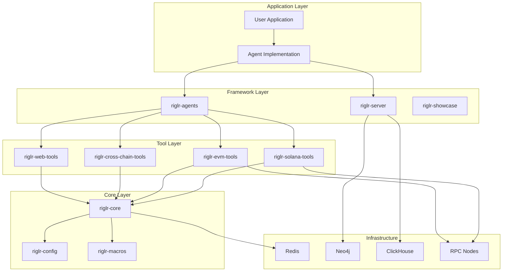
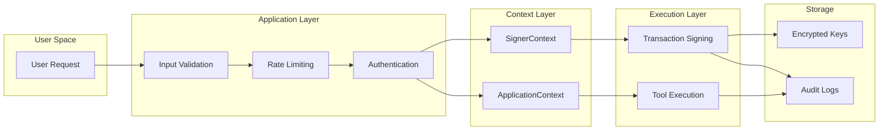

# riglr Architecture

riglr is a comprehensive, modular toolkit for building production-grade, AI-powered blockchain agents. It extends the `rig` AI framework with a robust ecosystem of libraries for on-chain operations, real-time data streaming, multi-agent coordination, and secure transaction management.

## Vision & Philosophy

**Core Vision**: Build a framework of libraries for creating powerful, autonomous on-chain applications. riglr follows a simple philosophy: build a library for `rig`, not an application. This ensures maximum flexibility and composability for developers building AI-powered blockchain agents.

### Design Principles

1. **Modularity & Composability**
   - Layered architecture with logical separation of concerns
   - Self-contained crates serving specific purposes
   - Adopt only what you need - minimal dependencies

2. **Context-Driven Architecture**
   - Unified configuration management via `riglr-config`
   - Type-safe dependency injection with `ApplicationContext`
   - Secure, isolated signer management with `SignerContext`

3. **Stateless & Testable**
   - Tools as pure functions with explicit dependencies
   - Strong typing throughout the system
   - Comprehensive testing utilities and mock implementations

4. **rig-First Integration**
   - Seamless integration via `#[tool]` macro
   - Agent-native design that empowers, not replaces, AI reasoning
   - Zero-cost abstractions with compile-time guarantees

5. **Production-Ready**
   - Async-first design with efficient resource pooling
   - Built-in rate limiting and retry logic
   - Security-first defaults with multi-layered key protection

## System Architecture

The riglr ecosystem follows a layered architecture with clear dependency relationships. Each layer builds upon the previous one, ensuring a clean and maintainable codebase.



For the complete dependency analysis and statistics, see the [Dependency Graph](../dependency-graph.md) page.

## Detailed Architectural Guides

- **[Core Patterns](core-patterns.md)**: A deep dive into the key design patterns like `SignerContext` and the two-layer retry strategy that ensure security and resilience.
- **[Request Lifecycle](request-lifecycle.md)**: A step-by-step walkthrough tracing a single request from a natural language prompt to a confirmed blockchain transaction.

## Layer-by-Layer Breakdown

### Core Framework Layer

#### riglr-core
The architectural foundation providing chain-agnostic abstractions:

**Core Components**:
- `Tool` trait for implementing blockchain operations
- `Job` and `JobResult` types for task execution
- `ToolWorker` for concurrent job processing with retry logic
- `SignerContext` for thread-local cryptographic signer management
- `ApplicationContext` for dependency injection
- Rich error types with retry semantics

**Key Design Decisions**:
- No blockchain SDK dependencies - maintains clean boundaries
- Uses type erasure for chain-agnostic interfaces
- Thread-local storage for secure signer isolation
- Arc-based dependency injection for shared resources

#### riglr-config
Unified configuration management:

**Configuration Structure**:
```rust
pub struct Config {
    pub app: AppConfig,
    pub network: NetworkConfig,
    pub database: Option<DatabaseConfig>,
    pub providers: ProvidersConfig,
    pub features: FeaturesConfig,
}
```

**Key Features**:
- Environment variable parsing and validation
- Multi-chain RPC URL management (`RPC_URL_{CHAIN_ID}` convention)
- Security-first defaults (testnet by default)
- Fail-fast validation at startup

#### riglr-macros
Code generation for superior developer experience:

**The `#[tool]` Macro**:
- Generates JSON schema from Rust structs
- Creates parameter validation logic
- Implements both `rig::Tool` and `riglr_core::Tool` traits
- Extracts documentation for LLM schemas
- Handles error conversion automatically
- Reduces 30+ lines of boilerplate to single annotation

### Tool Libraries Layer

#### Blockchain-Specific Tools

**riglr-solana-tools**:
- SOL and SPL token operations
- Jupiter aggregator integration
- Pump.fun trading
- Staking and delegation
- Risk analysis via RugCheck.xyz
- Transaction simulation and fee optimization

**riglr-evm-tools**:
- ETH and ERC-20/721/1155 support
- Uniswap and 1inch integration
- ENS domain operations
- Multi-chain support (Ethereum, Polygon, BSC, Arbitrum, etc.)
- Gas optimization and management

**riglr-cross-chain-tools**:
- Asset bridging via Li.Fi protocol
- Cross-chain message passing
- Unified portfolio tracking
- Atomic cross-chain swaps

#### Data Integration Tools

**riglr-web-tools**:
- Price feeds (CoinGecko, DexScreener)
- Social data (Twitter analytics)
- Market data (real-time quotes, historical)
- Web search (Exa integration)
- News aggregation

**riglr-graph-memory**:
- Neo4j knowledge graphs
- Advanced RAG system
- Semantic search
- Relationship mapping

### Services Layer

#### riglr-streams
Real-time blockchain event streaming:

**Stream Sources**:
- Solana Geyser WebSocket
- EVM WebSocket subscriptions
- Binance WebSocket API
- Mempool.space API

**Stream Operators**:
```rust
let processed_stream = source_stream
    .filter(|event| matches!(event.kind(), EventKind::Swap))
    .map(extract_metrics)
    .throttle(Duration::from_secs(10))
    .batch(50, Duration::from_secs(60));
```

**Resilience Features**:
- Automatic reconnection with exponential backoff
- Circuit breakers for failed connections
- Configurable buffering and backpressure handling
- Health monitoring and metrics

#### riglr-agents
Multi-agent coordination system:

**Core Components**:
- `AgentRegistry`: Local and distributed (Redis) agent discovery
- `AgentDispatcher`: Task routing based on capabilities
- `RigToolAdapter`: Bridge between riglr tools and rig agents
- Message passing for inter-agent communication

**Routing Strategies**:
- Capability-based routing
- Load balancing (least loaded, round robin)
- Priority-based scheduling
- Custom routing algorithms

#### riglr-indexer
Production-grade blockchain data indexing:

**Architecture**:
- Pipeline: Ingester → Processor → Storage
- Custom processors for domain-specific logic
- Multiple storage backends (PostgreSQL, Redis)
- Real-time indexing of blockchain events

**Performance**:
- 10,000+ events/second throughput
- Parallel worker pools
- Horizontal scaling with consistent hashing
- Memory-efficient streaming processing

### Application Layer

#### riglr-server
Production HTTP server using Axum/Actix:

**Features**:
- RESTful API endpoints
- WebSocket support for real-time updates
- Server-Sent Events (SSE) streaming
- Health checks and metrics endpoints
- Rate limiting and authentication middleware

**Deployment Ready**:
- Docker containerization
- Kubernetes manifests
- Prometheus metrics
- Structured logging
- Graceful shutdown handling

#### riglr-auth
Authentication and authorization:

**Supported Providers**:
- Privy (embedded wallets + social login)
- Web3Auth (non-custodial + social login)
- Magic.link (email-based authentication)

**Features**:
- JWT token validation
- Session management
- Multi-tenant isolation
- Signer factory pattern
- Permission-based access control

#### riglr-showcase
Example implementations and best practices:
- Trading bots with risk management
- DeFi yield farming automation
- Cross-chain arbitrage detection
- Social sentiment trading
- Multi-agent coordination workflows

## Inter-Layer Communication

### Context Propagation
```rust
// Context flows down through layers
ApplicationContext::from_config(&config)
    -> Agent.execute_task()
    -> ToolWorker.process_job()
    -> Tool.execute()
```

### Error Propagation
```rust
// Errors flow up with context preservation
ToolError::Retriable(chain_error)
    -> JobResult::Failure
    -> TaskResult::Error
    -> HTTP 5xx with retry headers
```

### Tool Registration and Discovery
```rust
// Tools register with workers
let worker = ToolWorker::new(config);
worker.register_tool(Arc::new(TransferSolTool::new())).await;

// Agents discover available tools
let available_tools = worker.list_tools().await;
```

## Security Architecture

### Private Key Management
1. **Isolation**: Keys confined to SignerContext scope
2. **No Logging**: Private keys never logged or exposed
3. **Automatic Cleanup**: Keys cleared when context exits
4. **Thread Safety**: Each async task has isolated context

### Transaction Safety
1. **Input Validation**: All parameters validated before signing
2. **Slippage Protection**: Configurable tolerance for swaps
3. **Deadline Parameters**: Transactions expire to prevent stale execution
4. **Error Recovery**: Automatic retry with exponential backoff

## Performance Considerations

### Caching Strategy
- **RPC calls**: Intelligent caching with appropriate TTL
- **Price data**: Short-lived cache (10-30 seconds)
- **Static data**: Long-lived cache for token metadata

### Concurrency Control
- **Rate limiting**: Respect API quotas with built-in limiters
- **Connection pooling**: Reuse RPC connections efficiently
- **Semaphores**: Limit parallel operations to prevent overload

### Resource Management
- Arc-based sharing for read-only resources
- Bounded channels for backpressure
- Configurable worker pool sizes
- Memory limits for stream buffers

## Extensibility Patterns

### Adding New Blockchains
1. Implement the `TransactionSigner` trait for the new chain
2. Create chain-specific tools using `#[tool]` macro
3. Configure RPC endpoints via environment variables
4. Register tools with the appropriate worker

### Custom Tool Development
```rust
use riglr_macros::tool;
use riglr_core::ToolError;

#[tool]
/// Your tool description becomes the schema
async fn my_custom_tool(
    context: &ApplicationContext,
    /// Parameter descriptions are extracted
    param: String,
) -> Result<String, ToolError> {
    // Implementation here
}
```

## Getting Started

The fastest way to start is using the official project generator:

```bash
# Install the generator
cargo install create-riglr-app

# Create a new project
create-riglr-app my-trading-bot
```

## Next Steps

- Learn about [Core Patterns](core-patterns.md) like SignerContext and error handling
- Follow the complete [Request Lifecycle](request-lifecycle.md) from brain to blockchain
- Review [Security Best Practices](../security-best-practices.md) for production deployment

## Testing Strategy

### Multi-Level Testing
1. **Unit Tests**: Individual components in isolation
2. **Integration Tests**: Component interactions
3. **E2E Tests**: Complete workflows with mock blockchains
4. **Blockchain Tests**: Real testnet integration (marked with `#[ignore]`)

### Mock Infrastructure
- Mock implementations for all external dependencies
- Test-specific configuration injection
- Deterministic test data generation
- Transaction replay capabilities

## Deployment Architecture

### Development → Production Path
1. **Development**: Local keys and test networks
2. **Staging**: Environment variables and devnets  
3. **Production**: KMS integration and mainnets

### Monitoring and Observability
- Structured logging with appropriate levels
- Metrics collection for performance monitoring
- Error tracking and alerting for critical issues
- Distributed tracing for request flows

This layered, modular design ensures that riglr can scale from simple proof-of-concepts to enterprise-grade production deployments while maintaining security, performance, and developer experience.

## Core Design Principles

### 1. Separation of Concerns

The system maintains strict boundaries between different concerns:

- **Configuration**: Centralized in `riglr-config`, loaded once at startup
- **Security**: Managed through `SignerContext` for isolation
- **Dependencies**: Shared via `ApplicationContext` for efficiency
- **Business Logic**: Implemented as stateless tools
- **Coordination**: Handled by agents and orchestrators

### 2. Type Safety & Compile-Time Guarantees

riglr leverages Rust's type system extensively:

```rust
// Type-safe tool definition
#[tool]
async fn swap_tokens(
    from_token: String,     // Validated at compile time
    to_token: String,       // Required parameter
    amount: f64,            // Type-checked
    slippage: Option<f64>,  // Optional with default
    context: &ApplicationContext,
) -> Result<SwapResult, ToolError> {
    // Implementation
}
```

### 3. Async-First Architecture

All I/O operations are asynchronous by default:

- Non-blocking RPC calls
- Concurrent tool execution
- Parallel transaction processing
- Stream-based event handling

### 4. Fail-Fast Configuration

The system validates all configuration at startup:

```rust
// Configuration loaded and validated immediately
let config = Config::from_env(); // Panics on invalid config

// All subsequent operations guaranteed valid config
let rpc_url = config.network.get_rpc_url("ethereum");
```

## Security Architecture

### Multi-Layer Security Model



### Key Security Features

1. **Signer Isolation**: Each user/tenant has isolated signer access via thread-local storage
2. **No Key Exposure**: Private keys never passed as parameters or stored in memory
3. **Audit Logging**: All sensitive operations are logged for compliance
4. **Rate Limiting**: Built-in protection against abuse
5. **Input Validation**: Automatic validation through the `#[tool]` macro