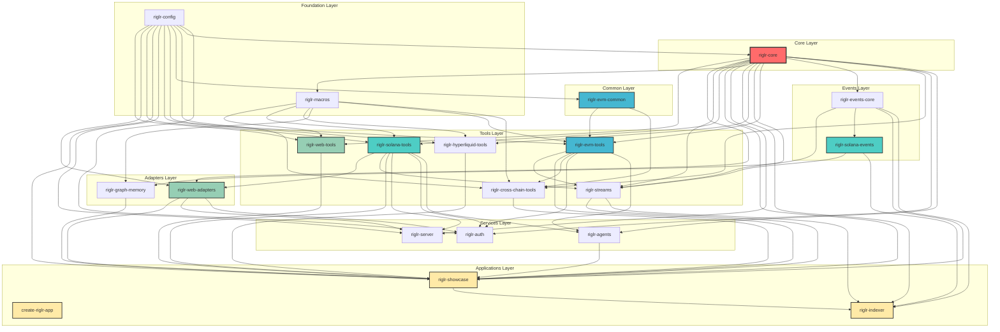

```mermaid
graph TB
    %% Core layer
    subgraph "Core Layer"
        core["riglr-core"]
    end
    
    subgraph "Foundation Layer"
        config["riglr-config"]
        macros["riglr-macros"]
    end
    
    subgraph "Common Layer"
        evm_common["riglr-evm-common"]
    end
    
    subgraph "Events Layer"
        events_core["riglr-events-core"]
        solana_events["riglr-solana-events"]
    end
    
    subgraph "Adapters Layer"
        graph_memory["riglr-graph-memory"]
        web_adapters["riglr-web-adapters"]
    end
    
    subgraph "Tools Layer"
        cross_chain_tools["riglr-cross-chain-tools"]
        evm_tools["riglr-evm-tools"]
        hyperliquid_tools["riglr-hyperliquid-tools"]
        solana_tools["riglr-solana-tools"]
        streams["riglr-streams"]
        web_tools["riglr-web-tools"]
    end
    
    subgraph "Services Layer"
        agents["riglr-agents"]
        auth["riglr-auth"]
        server["riglr-server"]
    end
    
    subgraph "Applications Layer"
        create_app["create-riglr-app"]
        indexer["riglr-indexer"]
        showcase["riglr-showcase"]
    end
    
    %% Dependencies
    core --> agents
    evm_tools --> agents
    solana_tools --> agents
    config --> auth
    core --> auth
    evm_tools --> auth
    solana_tools --> auth
    web_adapters --> auth
    config --> core
    config --> cross_chain_tools
    core --> cross_chain_tools
    evm_common --> cross_chain_tools
    evm_tools --> cross_chain_tools
    macros --> cross_chain_tools
    core --> events_core
    config --> evm_common
    config --> evm_tools
    core --> evm_tools
    evm_common --> evm_tools
    macros --> evm_tools
    core --> graph_memory
    macros --> graph_memory
    config --> hyperliquid_tools
    core --> hyperliquid_tools
    macros --> hyperliquid_tools
    core --> indexer
    events_core --> indexer
    showcase --> indexer
    solana_events --> indexer
    streams --> indexer
    core --> macros
    config --> server
    core --> server
    solana_tools --> server
    web_adapters --> server
    agents --> showcase
    config --> showcase
    core --> showcase
    cross_chain_tools --> showcase
    events_core --> showcase
    evm_tools --> showcase
    graph_memory --> showcase
    hyperliquid_tools --> showcase
    solana_tools --> showcase
    streams --> showcase
    web_adapters --> showcase
    web_tools --> showcase
    events_core --> solana_events
    config --> solana_tools
    core --> solana_tools
    macros --> solana_tools
    core --> streams
    events_core --> streams
    evm_tools --> streams
    solana_events --> streams
    solana_tools --> streams
    config --> web_adapters
    core --> web_adapters
    solana_tools --> web_adapters
    config --> web_tools
    core --> web_tools
    macros --> web_tools
    
    %% Styling
    classDef coreStyle fill:#ff6b6b,stroke:#333,stroke-width:3px
    classDef solanaStyle fill:#4ecdc4,stroke:#333,stroke-width:2px
    classDef evmStyle fill:#45b7d1,stroke:#333,stroke-width:2px
    classDef webStyle fill:#96ceb4,stroke:#333,stroke-width:2px
    classDef appStyle fill:#ffeaa7,stroke:#333,stroke-width:2px
    classDef otherStyle fill:#dfe6e9,stroke:#333,stroke-width:2px
    
    class core coreStyle
    class solana_tools,solana_events solanaStyle
    class evm_tools,evm_common evmStyle
    class web_tools,web_adapters webStyle
    class showcase,create_app,indexer appStyle
```