# Dependency Graph

*This file is auto-generated by `docs/generate_dependency_graph.py`*

## Dependency Table

| Crate | Direct Dependencies | Count | Layer |
|-------|---------------------|-------|-------|
| **create-riglr-app** | None | 0 | Applications |
| **riglr-config** | None | 0 | Foundation |
| **riglr-core** | riglr-config | 1 | Core |
| **riglr-events-core** | riglr-core | 1 | Events |
| **riglr-evm-common** | riglr-config | 1 | Common |
| **riglr-macros** | riglr-core | 1 | Foundation |
| **riglr-solana-events** | riglr-events-core | 1 | Events |
| **riglr-graph-memory** | riglr-core, riglr-macros | 2 | Adapters |
| **riglr-agents** | riglr-core, riglr-evm-tools, riglr-solana-tools | 3 | Services |
| **riglr-hyperliquid-tools** | riglr-config, riglr-core, riglr-macros | 3 | Tools |
| **riglr-solana-tools** | riglr-config, riglr-core, riglr-macros | 3 | Tools |
| **riglr-web-adapters** | riglr-config, riglr-core, riglr-solana-tools | 3 | Adapters |
| **riglr-web-tools** | riglr-config, riglr-core, riglr-macros | 3 | Tools |
| **riglr-evm-tools** | riglr-config, riglr-core, riglr-evm-common, riglr-macros | 4 | Tools |
| **riglr-server** | riglr-config, riglr-core, riglr-solana-tools, riglr-web-adapters | 4 | Services |
| **riglr-auth** | riglr-config, riglr-core, riglr-evm-tools, riglr-solana-tools, riglr-web-adapters | 5 | Services |
| **riglr-cross-chain-tools** | riglr-config, riglr-core, riglr-evm-common, riglr-evm-tools, riglr-macros | 5 | Tools |
| **riglr-indexer** | riglr-core, riglr-events-core, riglr-showcase, riglr-solana-events, riglr-streams | 5 | Applications |
| **riglr-streams** | riglr-core, riglr-events-core, riglr-evm-tools, riglr-solana-events, riglr-solana-tools | 5 | Tools |
| **riglr-showcase** | riglr-agents, riglr-config, riglr-core, riglr-cross-chain-tools, riglr-events-core, riglr-evm-tools, riglr-graph-memory, riglr-hyperliquid-tools, riglr-solana-tools, riglr-streams, riglr-web-adapters, riglr-web-tools | 12 | Applications |

## Dependency Statistics

- **Total crates**: 20
- **Total dependency relationships**: 62
- **Average dependencies per crate**: 3.1

### Most Dependent Crates (have most dependencies)

1. **riglr-showcase**: 12 dependencies
2. **riglr-auth**: 5 dependencies
3. **riglr-cross-chain-tools**: 5 dependencies
4. **riglr-streams**: 5 dependencies
5. **riglr-indexer**: 5 dependencies

### Most Depended Upon (used by most crates)

1. **riglr-core**: used by 15 crates
2. **riglr-config**: used by 11 crates
3. **riglr-macros**: used by 6 crates
4. **riglr-solana-tools**: used by 6 crates
5. **riglr-evm-tools**: used by 5 crates

## Dependency Graph (Mermaid)

```mermaid
graph TB
    %% Core layer
    subgraph "Core Layer"
        core["riglr-core"]
    end
    
    subgraph "Foundation Layer"
        config["riglr-config"]
        macros["riglr-macros"]
    end
    
    subgraph "Common Layer"
        evm_common["riglr-evm-common"]
    end
    
    subgraph "Events Layer"
        events_core["riglr-events-core"]
        solana_events["riglr-solana-events"]
    end
    
    subgraph "Adapters Layer"
        graph_memory["riglr-graph-memory"]
        web_adapters["riglr-web-adapters"]
    end
    
    subgraph "Tools Layer"
        cross_chain_tools["riglr-cross-chain-tools"]
        evm_tools["riglr-evm-tools"]
        hyperliquid_tools["riglr-hyperliquid-tools"]
        solana_tools["riglr-solana-tools"]
        streams["riglr-streams"]
        web_tools["riglr-web-tools"]
    end
    
    subgraph "Services Layer"
        agents["riglr-agents"]
        auth["riglr-auth"]
        server["riglr-server"]
    end
    
    subgraph "Applications Layer"
        create_app["create-riglr-app"]
        indexer["riglr-indexer"]
        showcase["riglr-showcase"]
    end
    
    %% Dependencies
    core --> agents
    evm_tools --> agents
    solana_tools --> agents
    config --> auth
    core --> auth
    evm_tools --> auth
    solana_tools --> auth
    web_adapters --> auth
    config --> core
    config --> cross_chain_tools
    core --> cross_chain_tools
    evm_common --> cross_chain_tools
    evm_tools --> cross_chain_tools
    macros --> cross_chain_tools
    core --> events_core
    config --> evm_common
    config --> evm_tools
    core --> evm_tools
    evm_common --> evm_tools
    macros --> evm_tools
    core --> graph_memory
    macros --> graph_memory
    config --> hyperliquid_tools
    core --> hyperliquid_tools
    macros --> hyperliquid_tools
    core --> indexer
    events_core --> indexer
    showcase --> indexer
    solana_events --> indexer
    streams --> indexer
    core --> macros
    config --> server
    core --> server
    solana_tools --> server
    web_adapters --> server
    agents --> showcase
    config --> showcase
    core --> showcase
    cross_chain_tools --> showcase
    events_core --> showcase
    evm_tools --> showcase
    graph_memory --> showcase
    hyperliquid_tools --> showcase
    solana_tools --> showcase
    streams --> showcase
    web_adapters --> showcase
    web_tools --> showcase
    events_core --> solana_events
    config --> solana_tools
    core --> solana_tools
    macros --> solana_tools
    core --> streams
    events_core --> streams
    evm_tools --> streams
    solana_events --> streams
    solana_tools --> streams
    config --> web_adapters
    core --> web_adapters
    solana_tools --> web_adapters
    config --> web_tools
    core --> web_tools
    macros --> web_tools
    
    %% Styling
    classDef coreStyle fill:#ff6b6b,stroke:#333,stroke-width:3px
    classDef solanaStyle fill:#4ecdc4,stroke:#333,stroke-width:2px
    classDef evmStyle fill:#45b7d1,stroke:#333,stroke-width:2px
    classDef webStyle fill:#96ceb4,stroke:#333,stroke-width:2px
    classDef appStyle fill:#ffeaa7,stroke:#333,stroke-width:2px
    classDef otherStyle fill:#dfe6e9,stroke:#333,stroke-width:2px
    
    class core coreStyle
    class solana_tools,solana_events solanaStyle
    class evm_tools,evm_common evmStyle
    class web_tools,web_adapters webStyle
    class showcase,create_app,indexer appStyle
```

## Architecture Layers

### 1. **Core Layer**

The foundational crate that all others depend on

- `riglr-core`: 1 direct dependencies

### 2. **Foundation Layer**

Configuration management and procedural macros

- `riglr-config`: 0 direct dependencies
- `riglr-macros`: 1 direct dependencies

### 3. **Common Layer**

Shared utilities for specific blockchains

- `riglr-evm-common`: 1 direct dependencies

### 4. **Events Layer**

Event processing and streaming

- `riglr-events-core`: 1 direct dependencies
- `riglr-solana-events`: 1 direct dependencies

### 5. **Tools Layer**

Blockchain-specific tools and integrations

- `riglr-cross-chain-tools`: 5 direct dependencies
- `riglr-evm-tools`: 4 direct dependencies
- `riglr-hyperliquid-tools`: 3 direct dependencies
- `riglr-solana-tools`: 3 direct dependencies
- `riglr-streams`: 5 direct dependencies
- `riglr-web-tools`: 3 direct dependencies

### 6. **Adapters Layer**

External service adapters

- `riglr-graph-memory`: 2 direct dependencies
- `riglr-web-adapters`: 3 direct dependencies

### 7. **Services Layer**

Application services and middleware

- `riglr-agents`: 3 direct dependencies
- `riglr-auth`: 5 direct dependencies
- `riglr-server`: 4 direct dependencies

### 8. **Applications Layer**

End-user applications and examples

- `create-riglr-app`: 0 direct dependencies
- `riglr-indexer`: 5 direct dependencies
- `riglr-showcase`: 12 direct dependencies

## Key Insights

1. **riglr-core** is the absolute foundation - 15 out of 20 crates depend on it
2. **riglr-showcase** serves as an integration point with 12 direct dependencies
3. The architecture follows a clear layered approach with increasing specialization
4. Blockchain-specific tools (Solana, EVM) are well-separated but share common foundations