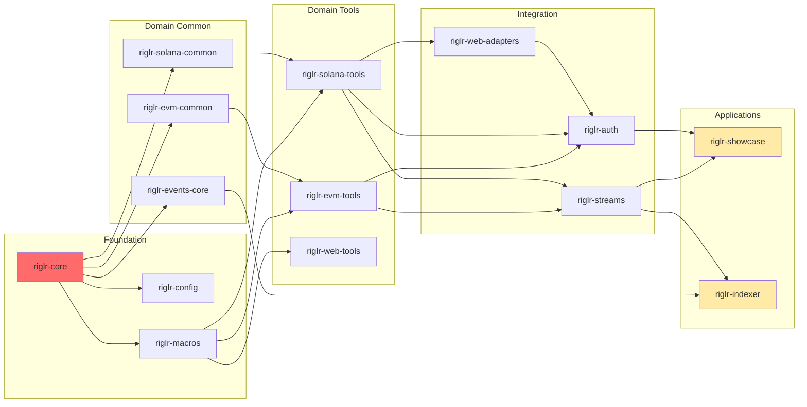

# Riglr Dependency Graph

## Dependency Table

| Crate | Direct Dependencies | Count | Layer |
|-------|---------------------|-------|-------|
| **riglr-core** | None | 0 | Core |
| **riglr-config** | riglr-core | 1 | Foundation |
| **riglr-macros** | riglr-core | 1 | Foundation |
| **riglr-solana-common** | riglr-core | 1 | Common |
| **riglr-evm-common** | riglr-core | 1 | Common |
| **riglr-events-core** | riglr-core | 1 | Events |
| **riglr-solana-events** | riglr-events-core | 1 | Events |
| **riglr-agents** | riglr-core | 1 | Services |
| **riglr-web-tools** | riglr-core, riglr-macros | 2 | Tools |
| **riglr-graph-memory** | riglr-core, riglr-macros | 2 | Adapters |
| **riglr-web-adapters** | riglr-core, riglr-solana-tools | 2 | Adapters |
| **riglr-server** | riglr-core, riglr-web-adapters | 2 | Services |
| **riglr-solana-tools** | riglr-core, riglr-macros, riglr-solana-common | 3 | Tools |
| **riglr-evm-tools** | riglr-config, riglr-core, riglr-macros | 3 | Tools |
| **riglr-hyperliquid-tools** | riglr-core, riglr-macros, riglr-solana-tools | 3 | Tools |
| **riglr-auth** | riglr-core, riglr-evm-tools, riglr-solana-tools, riglr-web-adapters | 4 | Services |
| **riglr-indexer** | riglr-core, riglr-events-core, riglr-solana-events, riglr-streams | 4 | Applications |
| **riglr-cross-chain-tools** | riglr-core, riglr-evm-common, riglr-macros, riglr-solana-common, riglr-solana-tools | 5 | Tools |
| **riglr-streams** | riglr-core, riglr-events-core, riglr-evm-tools, riglr-solana-events, riglr-solana-tools | 5 | Tools |
| **riglr-showcase** | riglr-agents, riglr-config, riglr-core, riglr-cross-chain-tools, riglr-events-core, riglr-evm-tools, riglr-graph-memory, riglr-hyperliquid-tools, riglr-solana-tools, riglr-streams, riglr-web-adapters, riglr-web-tools | 12 | Applications |
| **create-riglr-app** | None | 0 | Applications |

## Dependency Statistics

- **Total crates**: 21
- **Total dependency relationships**: 56
- **Average dependencies per crate**: 2.7

### Most Dependent Crates (have most dependencies)

1. **riglr-showcase**: 12 dependencies
2. **riglr-cross-chain-tools**: 5 dependencies
3. **riglr-streams**: 5 dependencies
4. **riglr-auth**: 4 dependencies
5. **riglr-indexer**: 4 dependencies

### Most Depended Upon (used by most crates)

1. **riglr-core**: used by 17 crates
2. **riglr-macros**: used by 7 crates
3. **riglr-solana-tools**: used by 5 crates
4. **riglr-events-core**: used by 3 crates
5. **riglr-evm-tools**: used by 2 crates

## Dependency Graph (Mermaid)

```mermaid
graph TB
    %% Core layer
    subgraph "Core Layer"
        core["riglr-core"]
    end
    
    %% Foundation layer
    subgraph "Foundation Layer"
        config["riglr-config"]
        macros["riglr-macros"]
    end
    
    %% Common layer
    subgraph "Common Layer"
        solanaCommon["riglr-solana-common"]
        evmCommon["riglr-evm-common"]
    end
    
    %% Events layer
    subgraph "Events Layer"
        eventsCore["riglr-events-core"]
        solanaEvents["riglr-solana-events"]
    end
    
    %% Adapters layer
    subgraph "Adapters Layer"
        graphMemory["riglr-graph-memory"]
        webAdapters["riglr-web-adapters"]
    end
    
    %% Tools layer
    subgraph "Tools Layer"
        solanaTools["riglr-solana-tools"]
        evmTools["riglr-evm-tools"]
        webTools["riglr-web-tools"]
        hyperliquidTools["riglr-hyperliquid-tools"]
        crossChainTools["riglr-cross-chain-tools"]
        streams["riglr-streams"]
    end
    
    %% Services layer
    subgraph "Services Layer"
        auth["riglr-auth"]
        server["riglr-server"]
        agents["riglr-agents"]
    end
    
    %% Applications layer
    subgraph "Applications Layer"
        showcase["riglr-showcase"]
        indexer["riglr-indexer"]
        createApp["create-riglr-app"]
    end
    
    %% Dependencies
    core --> config
    core --> macros
    core --> solanaCommon
    core --> evmCommon
    core --> eventsCore
    core --> graphMemory
    core --> webTools
    core --> solanaTools
    core --> evmTools
    core --> webAdapters
    core --> auth
    core --> server
    core --> agents
    core --> hyperliquidTools
    core --> crossChainTools
    core --> streams
    core --> indexer
    core --> showcase
    
    macros --> solanaTools
    macros --> evmTools
    macros --> webTools
    macros --> graphMemory
    macros --> hyperliquidTools
    macros --> crossChainTools
    
    config --> evmTools
    config --> showcase
    
    solanaCommon --> solanaTools
    solanaCommon --> crossChainTools
    
    evmCommon --> crossChainTools
    
    eventsCore --> solanaEvents
    eventsCore --> streams
    eventsCore --> indexer
    eventsCore --> showcase
    
    solanaEvents --> streams
    solanaEvents --> indexer
    
    solanaTools --> webAdapters
    solanaTools --> auth
    solanaTools --> hyperliquidTools
    solanaTools --> crossChainTools
    solanaTools --> streams
    solanaTools --> showcase
    
    evmTools --> auth
    evmTools --> streams
    evmTools --> showcase
    
    webTools --> showcase
    
    graphMemory --> showcase
    
    webAdapters --> auth
    webAdapters --> server
    webAdapters --> showcase
    
    agents --> showcase
    
    hyperliquidTools --> showcase
    
    crossChainTools --> showcase
    
    streams --> indexer
    streams --> showcase
    
    %% Styling
    classDef coreStyle fill:#ff6b6b,stroke:#333,stroke-width:3px
    classDef solanaStyle fill:#4ecdc4,stroke:#333,stroke-width:2px
    classDef evmStyle fill:#45b7d1,stroke:#333,stroke-width:2px
    classDef webStyle fill:#96ceb4,stroke:#333,stroke-width:2px
    classDef appStyle fill:#ffeaa7,stroke:#333,stroke-width:2px
    classDef otherStyle fill:#dfe6e9,stroke:#333,stroke-width:2px
    
    class core coreStyle
    class solanaCommon,solanaEvents,solanaTools solanaStyle
    class evmCommon,evmTools evmStyle
    class webTools,webAdapters webStyle
    class showcase,indexer,createApp appStyle
    class config,macros,eventsCore,graphMemory,auth,server,agents,hyperliquidTools,crossChainTools,streams otherStyle
```

## Simplified Dependency Flow

## Architecture Layers

### 1. **Core Layer**

- `riglr-core`: The foundational crate that all others depend on

### 2. **Foundation Layer**

- `riglr-config`: Configuration management
- `riglr-macros`: Procedural macros for code generation

### 3. **Common Layer**

- `riglr-solana-common`: Shared Solana utilities
- `riglr-evm-common`: Shared EVM utilities

### 4. **Events Layer**

- `riglr-events-core`: Core event processing
- `riglr-solana-events`: Solana-specific events

### 5. **Tools Layer**

- `riglr-solana-tools`: Solana blockchain tools
- `riglr-evm-tools`: EVM blockchain tools
- `riglr-web-tools`: Web-related tools
- `riglr-hyperliquid-tools`: Hyperliquid DEX tools
- `riglr-cross-chain-tools`: Cross-chain functionality
- `riglr-streams`: Event streaming

### 6. **Adapters Layer**

- `riglr-graph-memory`: Graph-based memory storage
- `riglr-web-adapters`: Web service adapters

### 7. **Services Layer**

- `riglr-auth`: Authentication services
- `riglr-server`: Server implementation
- `riglr-agents`: Agent system

### 8. **Applications Layer**

- `riglr-showcase`: Demo application (most dependencies)
- `riglr-indexer`: Blockchain indexer
- `create-riglr-app`: Application generator (standalone)

## Key Insights

1. **riglr-core** is the absolute foundation - 17 out of 21 crates depend on it
2. **riglr-showcase** serves as an integration point with 12 direct dependencies
3. **riglr-indexer** is a lean application with only 4 direct dependencies
4. **create-riglr-app** is completely independent (likely a CLI tool)
5. The architecture follows a clear layered approach with increasing specialization
6. Blockchain-specific tools (Solana, EVM) are well-separated but share common foundations
7. **riglr-macros** is widely used (7 crates) for code generation across tools