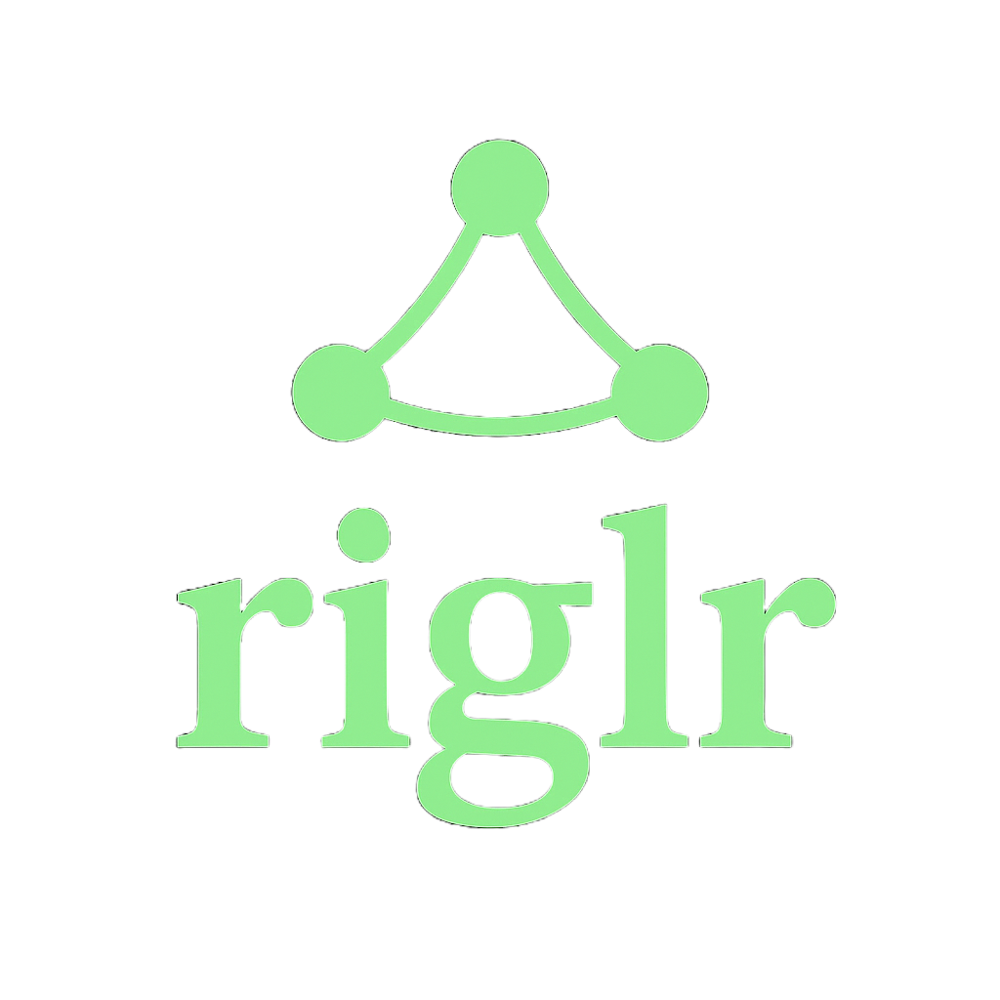

# Introduction to riglr

  

**riglr** (pronounced "riggler") transforms the powerful `rig` AI framework from a tool-calling "brain" into a complete "body and nervous system" for production blockchain AI agents. While `rig` provides the core LLM-to-tool pipeline, riglr adds the enterprise-grade infrastructure, security patterns, and blockchain-specific tooling needed to build, deploy, and scale real-world AI agents that interact with blockchains.

## From Brain to Blockchain: How riglr Elevates rig

The upstream `rig` crate excels at connecting LLMs to tools, but building production blockchain agents requires much more. riglr provides:

- **Security-First Architecture**: The `SignerContext` pattern ensures cryptographic keys are never exposed to the LLM reasoning loop, with complete multi-tenant isolation
- **Production Patterns**: Clean dependency injection, unified configuration, and fail-fast validation for enterprise deployments
- **Developer Velocity**: The `#[tool]` macro eliminates boilerplate while maintaining type safety and automatic documentation
- **Intelligent Error Handling**: Two-level error system with behavioral classification and automatic retry logic
- **Multi-Agent Orchestration**: Build swarms of specialized agents that collaborate on complex tasks
- **Real-Time Capabilities**: Transform agents from reactive to proactive with event streaming and data indexing
- **Turnkey Infrastructure**: Pre-configured servers, authentication providers, and deployment templates

Whether you're building a sophisticated DeFi trading bot, a market analysis agent, a cross-chain portfolio manager, or a distributed network of autonomous agents, riglr provides the secure, performant, and battle-tested components you need.

### Key Features

- **Agent Coordination** (`riglr-agents`): Build distributed networks of specialized agents with intelligent task routing and inter-agent communication.
- **Real-Time Streaming** (`riglr-streams`): Process high-throughput blockchain events and market data with powerful stream operators.
- **Data Indexing** (`riglr-indexer`): Production-grade indexing service with customizable pipelines for ingesting, processing, and storing on-chain data.
- **Unified Configuration** (`riglr-config`): Fail-fast configuration system with standardized chain management and environment-based settings.
- **Declarative Tool System**: Define complex blockchain operations with the simple `#[tool]` macro.
- **Secure by Design**: The `SignerContext` pattern ensures cryptographic keys are handled safely and isolated between requests.
- **Production-Ready**: With fail-fast configuration, robust error handling, and no mock implementations, riglr is built for real-world use.
- **Multi-Chain Native**: Built-in support for Solana, Ethereum, and any EVM-compatible chain.
- **Rich Data Integration**: Tools for web APIs, social media, and market data sources are included out of the box.

### Who is this for?

- **Developers** building AI-powered applications that interact with blockchains.
- **DeFi Teams** creating automated trading, monitoring, or portfolio management systems.
- **Researchers** exploring on-chain agent behavior and autonomous systems.

This documentation will guide you through setting up your first agent, understanding core concepts, and deploying your application to production.