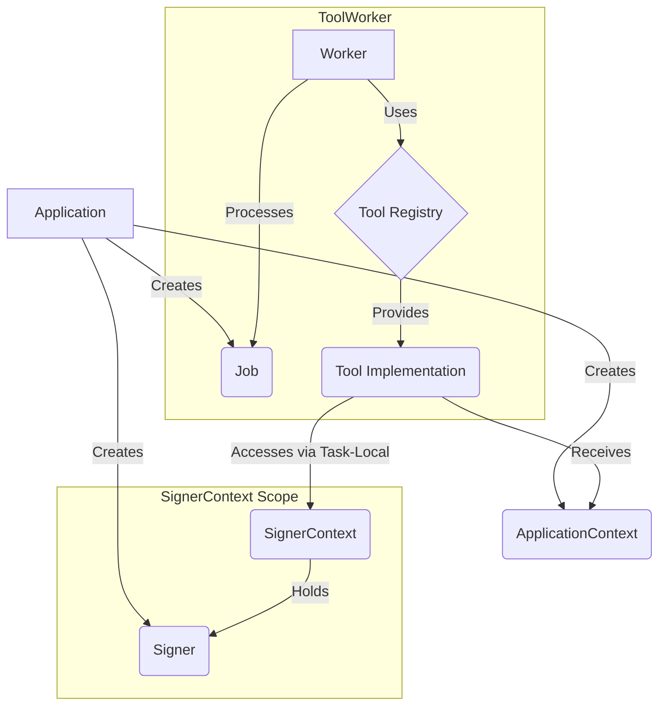

# riglr-core Architecture

## Overview

The riglr-core crate provides the foundational architectural patterns that power the entire riglr ecosystem. It implements a flexible, composable system for building blockchain agents with a focus on dependency injection, transactional security, and tool composition.

## Core Architectural Patterns

### 1. Tool System

The `Tool` trait is the fundamental building block for all agent capabilities:

- **Purpose**: Encapsulates reusable business logic
- **Design**: Async-first with dependency injection via `ApplicationContext`
- **Examples**: BlockchainTool, DatabaseTool, HttpTool

```rust
#[async_trait]
pub trait Tool: Send + Sync {
    type Input: Send + Sync;
    type Output: Send + Sync;
    
    async fn execute(
        &self,
        input: Self::Input,
        context: Arc<ApplicationContext>,
    ) -> Result<Self::Output>;
}
```

### 2. ToolWorker

The `ToolWorker` manages the lifecycle of job processing:

- **Purpose**: Processes jobs asynchronously using registered tools
- **Design**: Worker pool pattern with dynamic tool dispatch
- **Key Features**:
  - Automatic tool registry management
  - Job queue processing
  - Error handling and retry logic

### 3. Job and JobResult

Jobs represent units of work to be processed:

- **`Job`**: Contains tool identifier, input data, and metadata
- **`JobResult`**: Wraps the output with success/failure status
- **Design**: Type-erased for flexibility, with runtime type checking

### 4. ApplicationContext

Central dependency injection container:

- **Purpose**: Provides shared resources to all tools
- **Contains**:
  - Configuration
  - Database connections
  - HTTP clients
  - Cache instances
  - Custom dependencies
- **Design**: Arc-wrapped for cheap cloning and thread-safe access

### 5. SignerContext

Manages cryptographic signing operations with transactional semantics:

- **Purpose**: Ensures secure access to signing keys
- **Design**: Task-local storage for transaction-scoped access
- **Security Features**:
  - Scoped lifetime management
  - Automatic cleanup on scope exit
  - Prevents key leakage across boundaries

## Interaction Flow



## Usage Patterns

### 1. Tool Implementation

```rust
pub struct MyTool;

#[async_trait]
impl Tool for MyTool {
    type Input = MyInput;
    type Output = MyOutput;
    
    async fn execute(
        &self,
        input: Self::Input,
        context: Arc<ApplicationContext>,
    ) -> Result<Self::Output> {
        // Access shared resources
        let db = context.get::<Database>()?;
        
        // Access signer if in context
        if let Some(signer) = SignerContext::current() {
            // Perform signing operations
        }
        
        // Business logic here
        Ok(MyOutput::new())
    }
}
```

### 2. Worker Setup

```rust
// Create application context
let context = ApplicationContext::new()
    .with(database)
    .with(http_client)
    .build();

// Create worker with tools
let worker = ToolWorker::new(context.clone())
    .register_tool("my_tool", MyTool)
    .build();

// Process jobs
let job = Job::new("my_tool", input);
let result = worker.process(job).await?;
```

### 3. SignerContext Usage

```rust
// Set up signer context for a transaction
let signer = Signer::new(private_key);
let result = SignerContext::run_with(signer, async {
    // Within this scope, tools can access the signer
    let job = Job::new("sign_transaction", tx_input);
    worker.process(job).await
}).await?;
// Signer is automatically cleaned up here
```

## Design Principles

1. **Composition over Inheritance**: Tools are composed rather than inherited
2. **Dependency Injection**: All dependencies provided via context
3. **Type Safety**: Strong typing with runtime verification where needed
4. **Async-First**: All operations are async by default
5. **Security by Design**: Cryptographic operations are scoped and controlled
6. **Testability**: All components can be easily mocked and tested

## Benefits

- **Modularity**: Tools can be developed and tested independently
- **Reusability**: Tools can be shared across different agents
- **Scalability**: Worker pool can be scaled based on load
- **Security**: SignerContext prevents key leakage
- **Flexibility**: New tools can be added without modifying core
- **Maintainability**: Clear separation of concerns

## Best Practices

1. Keep tools focused on a single responsibility
2. Use ApplicationContext for shared dependencies
3. Always use SignerContext for cryptographic operations
4. Implement proper error handling in tools
5. Write comprehensive tests for each tool
6. Document tool inputs and outputs clearly